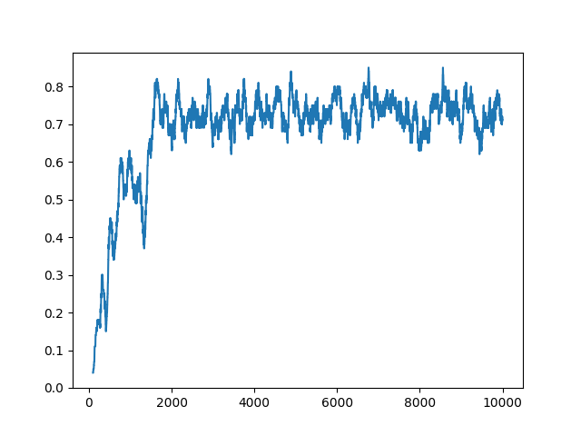
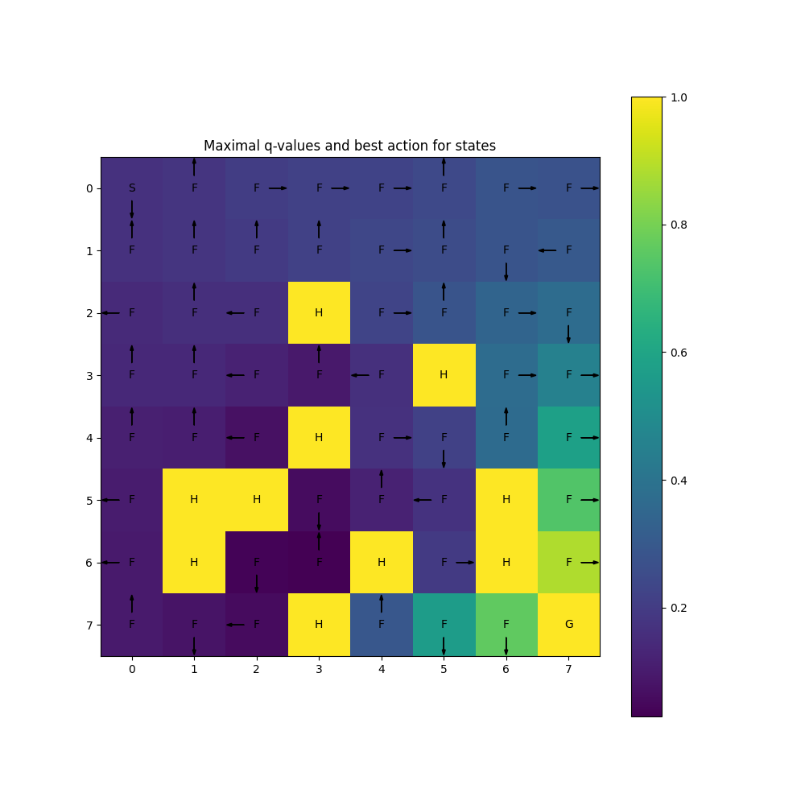

# Agent

Agent solves FrozenLake8x8 environment after ~2000 episodes with average reward around 0.75. A few characteristics of the agent:

* Used algorithm: QLearning.
* Used step size decay to speed up learning in early phases and to achieve more stable results at the end of training.
* Greedy action selection. Epsilon-greedy exploration decreased average reward.
* Explortation achieved with optimistic initialization of q-values (to 1.0).

Agent hyperparameters:
```python
QLearningAgent(
    env,
    epsilon=0.0,
    initial_step_size=0.5,
    discount=0.98,
    initial_q_value=1.0,
    step_size_decay=0.999,
    min_step_size=0.1
)

```

# Results

## Average reward from last 100 episodes vs episode number:




## Vizualization of q-values and best action for each state:



# Running the agent

## Using docker

Run commands from the root of the repository:
```
docker build -t frozen_lake .
docker run -it -v $PWD:/python frozen_lake
```
Vizualization of agent and plots will be saved to `output` directory.

## Using virtualenv

Create virtualenv with `python3.9`, activate it and run from the root of the repository:
```
pip install -r requriements.txt
pip install -e .
python solution/train_agent.py
```

Vizualization of agent and plots will be saved to `output` directory.
